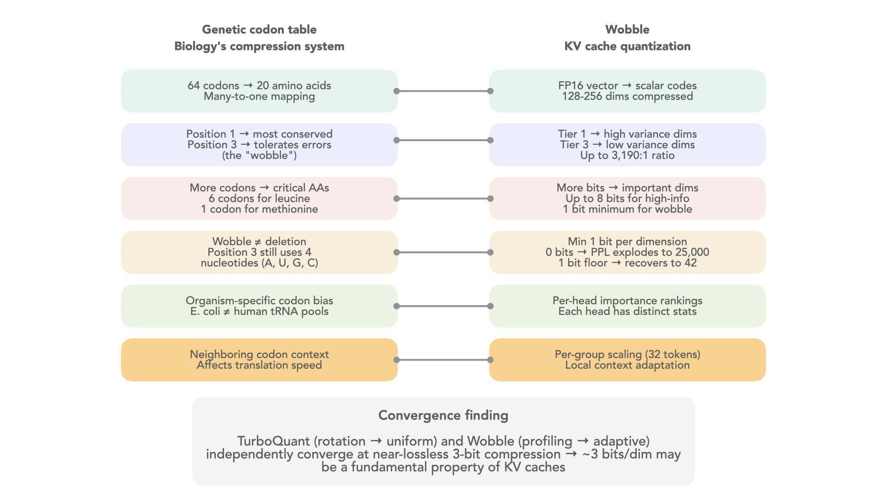

# Wobble: Adaptive KV Cache Quantization

Wobble allocates quantization bits per dimension based on empirically measured importance. High-variance dimensions get more bits; low-variance "wobble" dimensions get fewer. At 3-bit on Gemma-2-2B, this achieves **+0.02% perplexity degradation** -- effectively lossless.

<p align="center">
  
</p>

The name comes from molecular biology: in the genetic codon table, the third "wobble" position tolerates mutations because it contributes least to amino acid identity. KV cache dimensions exhibit the same pattern -- some carry critical information while others are expendable.

## Results

### Gemma-2-2B (26 layers, 4 KV heads, head_dim=256)

| Method | 3-bit PPL | vs FP16 | 2-bit PPL | vs FP16 |
|--------|-----------|---------|-----------|---------|
| FP16 baseline | 43.24 | -- | 43.24 | -- |
| **Wobble** | **43.25** | **+0.02%** | **39.69** | -8.2% |
| KIVI | 70.14 | +62.2% | 398.28 | +821% |
| TurboQuant | 17,950 | broken | 18,443 | broken |

### Mistral-7B (32 layers, 8 KV heads, head_dim=128)

| Method | 3-bit PPL | vs FP16 | 2-bit PPL | vs FP16 |
|--------|-----------|---------|-----------|---------|
| FP16 baseline | 5.38 | -- | 5.38 | -- |
| **Wobble** | **6.06** | **+12.6%** | **42.83** | +696% |
| KIVI | 6.35 | +18.0% | 198.09 | +3581% |

Wobble beats KIVI at every bit-width on every model tested. TurboQuant's rotation assumption fails catastrophically on post-RoPE KV values.

**Evaluation**: WikiText-103 validation, 50K tokens, sliding window (2048 context, 512 stride).

## How It Works

### Three Key Observations

1. **Dimension importance varies dramatically.** Variance ratios across dimensions are 13:1 median (up to 3,190:1 on Mistral-7B). Some dimensions carry critical information; others are near-constant "wobble positions."

2. **Heads are different organisms.** Jensen-Shannon divergence between KV heads is 0.37 nats median -- each head group needs its own quantization config.

3. **Dimensions are independent.** Mean |correlation| between dimensions is 0.06. This means scalar quantization is optimal -- vector quantization (PQ, rotation-based methods) wastes capacity modeling nonexistent correlations.

### Algorithm

```
1. PROFILE    Measure per-dimension variance and per-head JS divergence
              using streaming statistics (no full KV tensors stored)

2. GROUP      Cluster heads by JS divergence similarity
              (agglomerative clustering, threshold 0.15 nats)

3. ALLOCATE   Assign bits per dimension via greedy marginal distortion
              reduction: each bit goes to the dimension where it reduces
              quantization error most

4. QUANTIZE   Per-dimension scalar quantization with per-group local
              scaling (32-token windows) for tighter dynamic range
```

The bit allocation is rate-distortion optimal for independent Gaussian sources. Adding 1 bit to dimension `d` reduces distortion by `variance[d] * (3/4) * 4^(-current_bits[d])`. The greedy algorithm iteratively assigns bits to maximize this reduction.

## Quick Start

```bash
git clone https://github.com/YOUR_USERNAME/wobble-kv-quant.git
cd wobble-kv-quant
pip install -e .
```

### Reproduce Published Results

```bash
# Gemma-2-2B (~10GB VRAM, ~30 min)
HF_TOKEN=your_token python experiments/reproduce_gemma2.py

# Mistral-7B (~14GB VRAM, ~60 min)
HF_TOKEN=your_token python experiments/reproduce_mistral.py
```

### Profile a New Model

```python
from profiling.capture import profile_kv_cache
from profiling.heads import compute_js_divergence_matrix, group_heads
from wobble.quantize import build_config, encode, decode

# 1. Profile KV cache statistics
stats, reservoir = profile_kv_cache(
    model, tokenizer, calibration_texts,
    n_layers=32, n_kv_heads=8, head_dim=128,
)

# 2. Group heads by distribution similarity
js_matrix = compute_js_divergence_matrix(stats, layer_idx=0)
groups = group_heads(js_matrix, max_groups=8, divergence_threshold=0.15)

# 3. Build per-group quantization config
config = build_config(
    dim_variances=stats["k_variance"][0, 0],
    dim_means=stats["k_mean"][0, 0],
    dim_mins=kv_min, dim_maxs=kv_max,
    total_budget=3 * 128,  # 3 bits * 128 dims
    head_group_id=0, layer_idx=0,
)

# 4. Quantize/dequantize
codes, group_mins, group_maxs = encode(kv_vectors, config, group_size=32)
reconstructed = decode(codes, config, group_mins, group_maxs, group_size=32)
```

## Architecture

```
wobble-kv-quant/
├── wobble/                 # Core quantization library
│   ├── quantize.py         # Adaptive scalar quantization (encode/decode)
│   ├── allocate.py         # Rate-distortion optimal bit allocation
│   ├── baselines.py        # KIVI and uniform quantization baselines
│   ├── evaluate.py         # WikiText-103 perplexity evaluation
│   ├── patch.py            # Attention monkey-patching (Mistral, Gemma-2)
│   └── config.py           # Centralized configuration
├── profiling/              # Standalone KV cache analysis tools
│   ├── capture.py          # Streaming statistics (Chan et al. algorithm)
│   ├── importance.py       # Per-dimension importance scoring
│   ├── heads.py            # Head clustering via JS divergence
│   ├── distributions.py    # Distribution fitting (Gaussian/Laplace/Student-t)
│   └── report.py           # Go/no-go assessment and visualizations
├── experiments/            # Reproduction scripts
│   ├── reproduce_gemma2.py # Full Gemma-2-2B pipeline
│   ├── reproduce_mistral.py # Full Mistral-7B pipeline
│   └── calibration.py     # Multi-domain calibration data loading
└── results/                # Published numbers (JSON)
```

### Adding a New Model

1. Determine architecture params: `n_layers`, `n_kv_heads`, `head_dim`
2. Add a patch function to `wobble/patch.py` that imports the correct `apply_rotary_pos_emb` and `eager_attention_forward` from `transformers.models.<model>.modeling_<model>`
3. Handle model-specific attention args (Gemma-2 has `softcap` and `sliding_window`)

## Biological Analogy

```
Codon position 1 (high info)    -->  High-variance dimensions (most bits)
Codon position 3 (wobble)       -->  Low-variance dimensions (fewest bits)
Wobble has 4-letter alphabet    -->  Minimum 1 bit per dimension (never 0 at 2-bit)
Organism-specific tRNA pools    -->  Per-head-group adaptive configs
Synonymous codon context        -->  Per-group local scaling (32 tokens)
```

## Requirements

- Python 3.10+
- PyTorch 2.1+
- transformers 4.40+
- CUDA GPU with 10-20GB VRAM (model dependent)

## License

MIT
